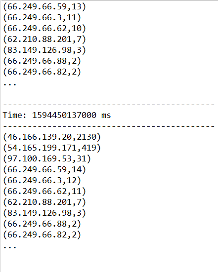

# Spark Streaming - Log Monitor

## Log Monitor Write-up

#### The first thing to do is to init a StreamingContext Object, specifying master, appName and batchDuration

```scala
val conf = new SparkConf().setMaster("local[*]").setAppName("LogMonitor")
val ssc = new StreamingContext(conf, Seconds(1))
```


Create a StreamingContext by providing the details necessary for creating a new SparkContext.



We are using local environment as our listener for this project, of course, spark streaming support different kinds of sources provider. Also you might consider integrating with AWS \(e.g. AWS Kinesis\) to create a real time data streaming analysis application. 


#### For achieving strong fault-tolerance guarantees, you might set the storage level for the input stream to StorageLevel.MEMORY\_AND\_DISK\_SER 


```scala
// listen to port 2345 from localhost 
```


> _Configuring write-ahead logs_ - Since Spark 1.2, we have introduced _write-ahead logs_ for achieving strong fault-tolerance guarantees. If enabled, all the data received from a receiver gets written into a write-ahead log in the configuration checkpoint directory. This prevents data loss on driver recovery, thus ensuring zero data loss \(discussed in detail in the [Fault-tolerance Semantics](https://spark.apache.org/docs/latest/streaming-programming-guide.html#fault-tolerance-semantics) section\). This can be enabled by setting the [configuration parameter](https://spark.apache.org/docs/latest/configuration.html#spark-streaming) `spark.streaming.receiver.writeAheadLog.enable` to `true`. However, these stronger semantics may come at the cost of the receiving throughput of individual receivers. This can be corrected by running [more receivers in parallel](https://spark.apache.org/docs/latest/streaming-programming-guide.html#level-of-parallelism-in-data-receiving) to increase aggregate throughput. Additionally, it is recommended that the replication of the received data within Spark be disabled when the write-ahead log is enabled as the log is already stored in a replicated storage system. This can be done by setting the storage level for the input stream to `StorageLevel.MEMORY_AND_DISK_SER`. While using S3 \(or any file system that does not support flushing\) for _write-ahead logs_, please remember to enable `spark.streaming.driver.writeAheadLog.closeFileAfterWrite` and `spark.streaming.receiver.writeAheadLog.closeFileAfterWrite`. See [Spark Streaming Configuration](https://spark.apache.org/docs/latest/configuration.html#spark-streaming) for more details. Note that Spark will not encrypt data written to the write-ahead log when I/O encryption is enabled. If encryption of the write-ahead log data is desired, it should be stored in a file system that supports encryption natively.
>
> FROM: [https://spark.apache.org/docs/latest/streaming-programming-guide.html](https://spark.apache.org/docs/latest/streaming-programming-guide.html)

#### Publish 2345 port via ncat streaming log.txt

```bash
ncat -kl 2345 < access_log.txt
```


Please be aware to use uncommonly used port, e.g. 1234, 2345, 9999



#### The logs we are accessing are Apache access logs

> 127.0.0.1 - frank \[10/Oct/2000:13:55:36 -0700\] "GET /apache\_pb.gif HTTP/1.0" 200 2326 "[http://www.example.com/start.html](http://www.example.com/start.html)" "Mozilla/4.08 \[en\] \(Win98; I ;Nav\)"

#### Regex is your friend to recognize the pattern and extract the desired part, in this case, IPv4 address is the target.

```scala
"""(\d{1,3}\.\d{1,3}\.\d{1,3}\.\d{1,3})""".r

// apacheLogsRegex
// (\d{1,3}\.\d{1,3}\.\d{1,3}\.\d{1,3})? 
// (\S+) (\S+) (\[.+?\]) "(.*?)" (\d{3}) (\S+) "(.*?)" "(.*?)"
```

```scala
import java.util.regex.Pattern
import java.util.regex.Matcher

Pattern.compile(apacheLogsRegex)

val ips = lines.map(x => {val matcher:Matcher = pattern.matcher(x); 
    if (matcher.matches()) matcher.group(1)})
    
val ipValidated = ips.map(x => {val ip = x.toString(); 
    if (ip != "()") ip else "[error]"})

// Reduce last 300 seconds of data, every 1 seconds
val ipCounts = ipValidated.map(x => (x, 1)).reduceByKeyAndWindow(_ + _, _ - _, Seconds(30), Seconds(1))

// Sorted by ip address's count and print the result
val sortedResults = ipCounts.transform(rdd => rdd.sortBy(x => x._2, false))
    sortedResults.print()
```

1. Implement regex - Apache Log =&gt; Return list of IP addresses
2. Validate IP addresses to filter out empty result
3. Count by key value \(IP address\)
4. Print and return the result

#### Final Step to run the program

```scala
ssc.checkpoint("F:/checkpoint/")
ssc.start()
ssc.awaitTermination()
```


All the data received from a receiver gets written into a write-ahead log in the configuration checkpoint directory


#### Result



